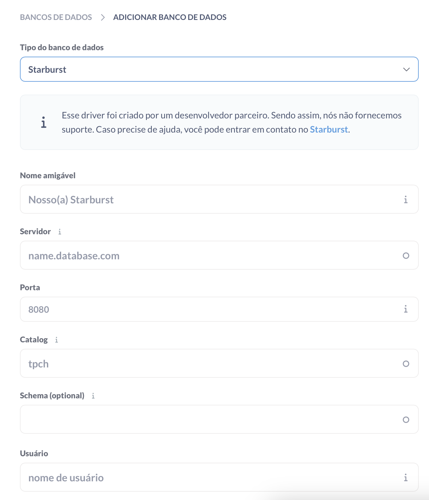

# Leage of Data


> League of Data is a study data pipeline project that uses League of Legends public APIs for ETL pipeline and data science.

### updates and improvements

The project still in development and the next updates will be coded in the following tasks:
- [x] Trino, Hive and MinIO for data catalog and data lake
- [x] integrate with metabase for data analysis
- [ ] ELT for shop items in LoL
- [ ] create model that recommend for you a build of items based on chosen Champion

## 💻 pre-requisites

Before start, verify if you have the following things installed:
- Docker and docker-compose
- cURL
- python

## 🚀 installing

For install from source, first you need:

- clone repository
```sh
git clone https://github.com/roqueando/league-of-data.git
```

- create venv
```sh
python -m venv venv
```

- install dependencies
```sh
# activate virtualenv
source ./.venv/bin/activate

# install deps
pip install -r requirements.txt
```

- install hive jars
```sh
./setup.sh
```

- create the app image
```sh
make build
```

## ☕using

This data pipeline works with Airflow for orchestrating so first of all:
- up the containers

```sh
docker-compose up -d
```

## 📊setting up metabase

Metabase will be loaded with plugins (inside the plugins folder you can see all plugins that metabase has) but you will need to setup the Trino. Make sure the database type (Tipo de banco de dados in the image below) is Starburst, then populate with the values that is in `.env.example`. Trino by default in docker does not have password, so you does not need input one, but in a real and production data project all of these is needed to be in a vault or some secret.


